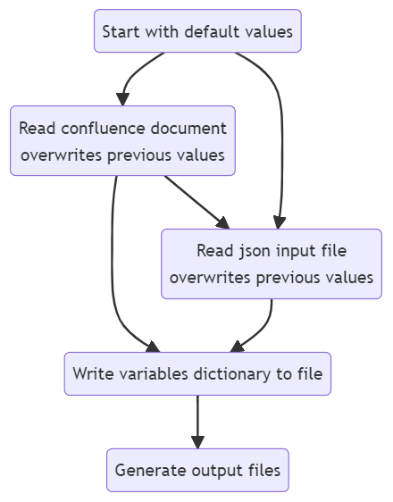

# Data Engineering Processor (DEP)

## **Purpose**

To automate the standard data engineering process at MECCA by auto-populating DDL, DAG and documentation files in order to:

- mitigate copy-paste and syntax errors;
- save time on rewriting code/finding code to copy;
- follow best practices in terms of naming conventions, code formatting and layout
___
## **Quick Start**

1. Create a confluence/word document using one of the provided templates:
    - New Table Template
    - Import Template

2. In confluence, click the three dots in the top right of the page and from the list choose Export > Export to Word
    - Ensure it is saved as a .doc file –  .docx can be converted to .doc by opening in Word and using Save As
    - Save the document in the directory that you will run DEP

3. Open a console and navigate to the directory of the input file you have exported

4. Type `dep.py` and press the enter key
    - It will use the first file found with extention .doc in the current directory
    - A directory called dep-output will be created with the output files within
    - A file called vars.json will also have been created which has the values used to create the output file. This can be editted and used as the input json file:  `dep.py --json vars.json`

5. For help: `dep.py -h`
___
## **Output**
- dep-output directory
- vars.json file – _a json file containing the values used to create the files, this can be altered and also used as an input to DEP_
- DDL SQL file – _sql table and view definitions_
- DAG Python file – _airflow scheduled etl pipeline_
- Unit test Markdown file – _table definition and row unit tests_

___
## **Input**



DEP can get information from either `*.doc`, `input.json` or both. By default, DEP looks for these files in the current directory. If the files exist, the `*.doc` is read first followed by `input.json`. Thus, variables found in the confluence doc can be overwritten by declaration in the JSON file by design. Either of the files may be absent, although a table structure must be defined in at least one of these files. Placeholder values are given to variables not found in the input files and are denoted by 'xxx' for easy search-and-replace functionality.

The input file paths can be specified by command line arguments: `dep.py --doc /path/to/doc --json /path/to/json`

### **Confluence Input**

Confluence pages can be exported to a .doc format and placed in the working directory to be read by DEP. The first .doc file found in the directory will be used. Alternatively, the file cm be specified with command line arguments. DEP looks for specific headers and
section contents under the headers to identify specific information. The headings can be in any order and are read in a case insensitive manner. The following headers and are read from the document:

**_Action: New Table_**

| **Heading Name**            | **Heading type** | **Information extracted**                                                       | **Section contents**                                                                                                                                        | **Used In**                                                  |
|-----------------------------|------------------|---------------------------------------------------------------------------------|-------------------------------------------------------------------------------------------------------------------------------------------------------------|--------------------------------------------------------------|
| {schema}.{table}            | Confluence title |  Schema and table name                                                          | NA                                                                                                                                                          | Everywhere                                                   |
| Overview                    | h1/h2 heading    | Table description<br>Subject area                                               | Overview of new table<br>Section should begin with a concise one sentence description<br>A problem statement following the format Working in (.*) I want to | DDL table comment                                            |
| Status                      | h1/h2 heading    | Jira ID                                                                         | Link to Jira Issue – most recent at the top                                                                                                                 | DDL file name<br>Unit test file name<br>Unit test title      |
| Granularity                 | h1/h2 heading    | Primary keys                                                                    | List of primary keys – no text underneath                                                                                                                   | DDL table definition<br>DAG ON CONFLICT                      |
| Indexes                     | h1/h2 heading    | Indexes                                                                         | List of indexes only – no text underneath                                                                                                                   | DDL table definition                                         |
| Update Method               | h1/h2 heading    | Method (to be initialised)<br>Schedule                                          | Method: {Incremental/Insert}<br>Schedule: {e.g. Sunday 10PM}                                                                                                | Insert type in DAG (method) <br>DDL table comment (schedule) |
| DFD                         | h1/h2 heading    | To use a staging table                                                          | DFD<br>Description of DFD – include text staging to include a staging table                                                                                 | Staging table in DAG flow                                    |
| Table structure             | h1/h2 heading    | Column names<br>Data Types<br>Nullable<br>Descriptions<br>Source tables/columns | Table with columns for: <br>Column Name<br>Data Type<br>Nullable<br>Description<br>Source/Column                                                            | Table DDL definition<br>DAG SQL (source tables/columns)      |
| View Structure              | h1/h2 heading    | View DDL definition                                                             | Table with columns for: <br>Column Name<br>Description<br>Source/Column                                                                                     | View DDL definition                                          |
| Materialized View Structure | h1/h2 heading    | Materialized View DDL definition                                                | Table with columns for: <br>Column Name<br>Description<br>Source/Column                                                                                     | Mat. View DDL definition                                     |
| Created By                  | h1/h2 heading    | Engineer name<br>Engineer email                                                 | Firstname Lastname (email)                                                                                                                                  | DDL table comment (name)<br>DAG email (email)                |

**_Action: Import_**

| Heading Name              | Heading type     | Information extracted                                                                 | Section contents                                                                                                                                                                                                                                                                                                                    | Used In                                                                      |
|---------------------------|------------------|---------------------------------------------------------------------------------------|-------------------------------------------------------------------------------------------------------------------------------------------------------------------------------------------------------------------------------------------------------------------------------------------------------------------------------------|------------------------------------------------------------------------------|
| sys_{schema}              | Confluence title | Schema name<br>Action to perform = import when title starts with sys_                 | NA                                                                                                                                                                                                                                                                                                                                  | Everywhere                                                                   |
| Overview                  | h1/h2 heading    | Schema description<br>Subject area                                                    | Overview of schema<br>Section should begin with a concise one sentence description<br>A problem statement following the format Working in (.*) I want to                                                                                                                                                                            | DDL schema comment (schema description)<br>DDL table comments (subject area) |
| Status                    | h1/h2 heading    | Jira ID                                                                               | Link to Jira Issue – most recent at the top                                                                                                                                                                                                                                                                                         | DDL file name<br>Unit test file name<br>Unit test title                      |
| Import Method             | h1/h2 heading    | Schedule<br>Import method for each table: Incrementally or full load with soft delete | Schedule: {e.g. Sunday 10PM}<br>Table with columns:<br>Table Name<br>Import Method – Incremental or full                                                                                                                                                                                                                            | DDL table comment (schedule)<br>DAG SQL                                      |
| {sys_schema}.{table_name} | h1/h2 heading    | Each table to be imported and their definitions                                       | One for each table to be imported. Subsections:<br>Description – First sentence should be concise descritption<br>Granuarity – List of primary keys<br>Indexes – List of indexes<br>Foreign Keys – List of foreign keys<br>Table Structure –  with columns:<br>Column Name<br>Data Type<br>Nullable<br>Description<br>Source/Column | DDL table definition<br>DAG SQL                                              |
| Created By                | h1/h2 heading    | Engineer name<br>Engineer email                                                       | Firstname Lastname (email)                                                                                                                                                                                                                                                                                                          | DDL table comment (name)<br>DAG email (email)                                |

### **JSON Input**

Default variables and those from confluence can be overwritten in a JSON input file. By default, DEP looks for `input.json` in the working directory although the file to use can be specified with command line arguments.

In the following example the four variables, whether found in a confluence document or not will be replaced with the following details:

**Supplementary `input.json`:**

```JSON
{
    "user": "zoeseeger",
    "user_email": "zoe.seeger@mecca.com.au",
    "subject_area": "Loss prevention",
    "schedule": "Monday 2PM"
}
```

In this way JSON input files can be used to either supplement the information found in the confluence document.

Alternatively, when DEP is run, a `vars.json` file is created which holds the runtime variables used to create the output files.  This output file can then be used as an input file with updated values.

**Standalone `input.json`:**

```JSON
{
    "jira_id": "GID-3069",
    "action": "import",
    "output_dir": "dep-output",
    "user": "Zoe Seeger",
    "user_email": "zoe.seeger@mecca.com.au",
    "description": "This is the schema for the Tester Order System (TOS) which resides in mecca_oms (Host:db005wp.mecca.com.au) in the dbo schema",
    "subject_area": "Supply Chain",
    "schedule": "Sunday 10PM",
    "staging_table": false,
    "ddl_file": "GID-3069_sys_new_ddl.sql",
    "dag_file": "import_sys_new.py",
    "doc_file": "Unit-Test-GID-3069_sys_new.md",
    "table_structures": [
        {
            "schema": "sys_new",
            "table_name": "orderitemadjustmentreasons",
            "schema_table": "sys_new.orderitemadjustmentreasons",
            "import_method": "full",
            "table_description": "Order adjustment reasons for orderitems",
            "columns": [
                "order_item_adjustment_reason_id",
                "reason",
                "record_created",
                "record_updated",
                "record_deleted"
            ],
            "types": [
                "int4",
                "text",
                "timestamptz",
                "timestamptz",
                "timestamptz"
            ],
            "nullables": [
                "NOT NULL",
                "NOT NULL",
                "NOT NULL",
                "NOT NULL",
                "NULL"
            ],
            "descriptions": [
                "",
                "",
                "",
                "",
                ""
            ],
            "source_columns": [
                "orderitemadjustmentreasonid",
                "",
                "",
                "",
                ""
            ],
            "source_alias": [
                "o",
                "o",
                "",
                "",
                ""
            ],
            "sources": {
                "dbo.orderitemadjustmentreasons": {
                    "alias": "o",
                    "source_table": "dbo.orderitemadjustmentreasons"
                }
            },
            "indexes": [],
            "primary_keys": [
                "order_item_adjustment_reason_id"
            ],
            "foreign_keys": []
        },
        {
            "schema": "sys_new",
            "table_name": "orderitems",
            "schema_table": "sys_new.orderitems",
            "import_method": "incremental",
            "table_description": "Tester order items",
            "columns": [
                "order_item_id",
                "order_id",
                "item_code",
                "description",
                "quantity",
                "unit_price",
                "adjusted_quantity",
                "order_item_adjustment_reason_id",
                "record_created",
                "record_updated"
            ],
            "types": [
                "uuid",
                "uuid",
                "text",
                "text",
                "int4",
                "numeric",
                "int4",
                "int4",
                "timestamptz",
                "timestamptz"
            ],
            "nullables": [
                "NOT NULL",
                "NOT NULL",
                "NOT NULL",
                "NULL",
                "NOT NULL",
                "NOT NULL",
                "NULL",
                "NULL",
                "NOT NULL",
                "NOT NULL"
            ],
            "descriptions": [
                "",
                "",
                "",
                "",
                "",
                "",
                "",
                "",
                "",
                ""
            ],
            "source_columns": [
                "orderitemid",
                "orderid",
                "itemcode",
                "",
                "",
                "unitprice",
                "adjustedquantity",
                "orderitemadjustmentreasonid",
                "",
                ""
            ],
            "source_alias": [
                "o",
                "o",
                "o",
                "o",
                "o",
                "o",
                "o",
                "o",
                "",
                ""
            ],
            "sources": {
                "dbo.orderitems": {
                    "alias": "o",
                    "source_table": "dbo.orderitems"
                }
            },
            "indexes": [
                "order_id",
                "item_code",
                "record_updated"
            ],
            "primary_keys": [
                "order_item_id"
            ],
            "foreign_keys": [
                "order_item_adjustment_reason_id"
            ]
        }
    ],
    "view_structures": [],
    "debug": true
}
```